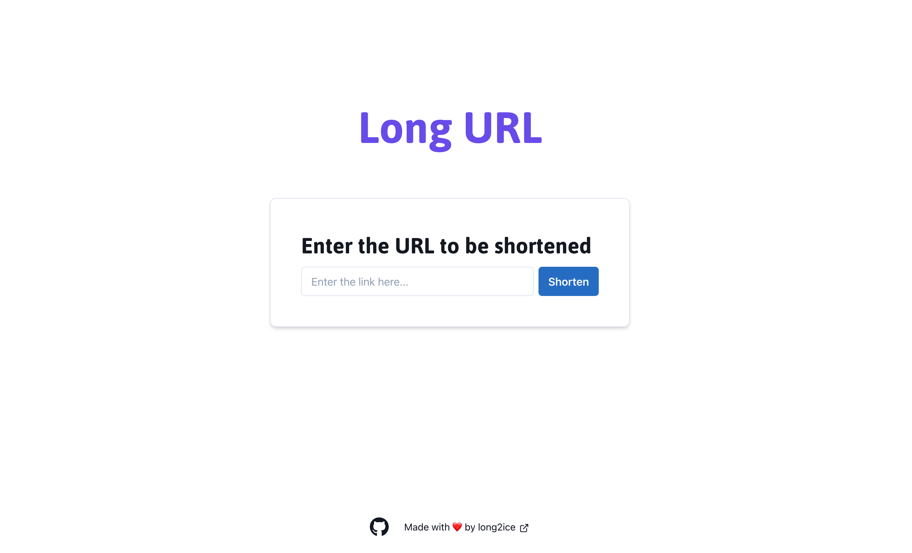

# longurl

[](https://github.com/long2ice/longurl/actions/workflows/deploy.yml)
[](https://pkg.go.dev/github.com/long2ice/longurl)



## Introduction

`longurl` is a self-hosted short url service.

## Try It Out

```shell
curl -H "Content-Type:application/json" -X POST --data '{"url": "https://github.com/long2ice/longurl"}' https://longurl.long2ice.io
```

Return like this:

```json
{
  "url": "https://longurl.long2ice.io/3FXrsHE"
}
```

Now Visit <https://longurl.long2ice.io/3FXrsHE>.

### Params

- `url`: the url to be shorted.
- `path`: the custom path for short url, can config allow or not.
- `expire_at`: when the short url expire, can set default expire in config.

## Deploy

First write a `config.yaml`.

```yaml
server:
  host: 0.0.0.0
  port: 3000
  logTimezone: Asia/Shanghai
  logTimeFormat: 2006-01-02 15:04:05.000000
url:
  domain: localhost:3000
  schema: http
  length: 7                 # the path length
  allowCustomPath: true     # allow custom short url path
  expireSeconds: 2592000    # default expire seconds
  unque: true               # same urls only generate one short url
database:
  type: mysql
  dsn: root:123456@tcp(127.0.0.1:3306)/longurl?parseTime=true
```

Then run with `docker`.

```shell
docker run -d -p 3000:3000 --name longurl -v /config.yaml:/config.yaml ghcr.io/long2ice/longurl/longurl
```

You can visit <http://localhost:3000/docs> to see the API docs.

## Frontend

The frontend project is [https://github.com/long2ice/longurl-web](https://github.com/long2ice/longurl-web).

## Credits

- [Fiber](https://github.com/gofiber/fiber), Express inspired web framework written in Go.
- [Ent](https://github.com/ent/ent), An entity framework for Go.
- [Sonyflake](https://github.com/sony/sonyflake), A distributed unique ID generator inspired by Twitter's Snowflake.

## License

This project is licensed under the
[Apache-2.0](https://github.com/long2ice/longurl/blob/master/LICENSE)
License.